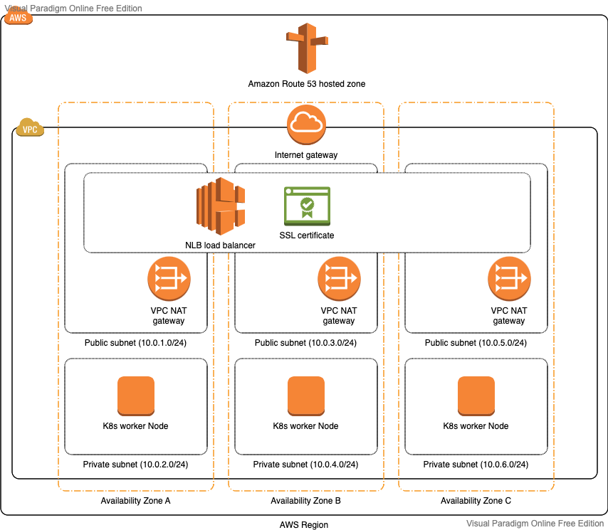

# Deploy Todo Application with DocDB(MongoDB) on AWS EKS



## About ##
This is an example showing how to deploy a Todo application integrated with DocDB(MongoDB) on to multiple AZs using EKS.

1. Here application and dataBase are deployed in different private subnets which are not directly accessible to outside world.
3. For deploying application on to EKS we need Docker Images for both [Todo-App](https://github.com/Raghav2211/spring-web-flux-todo-app/blob/master/todo-app/README.md) & [Edge-Services](https://github.com/Raghav2211/spring-web-flux-todo-app/blob/master/edge-service/README.md).
4. To access todo application in outside world we need deploy External-DNS, Ingress Controller(Using [nginx-ingress-controller](https://docs.nginx.com/nginx-ingress-controller/)) and Route53

## Prerequisite ##

- Install AWS CLI

  `https://cloudaffaire.com/how-to-install-aws-cli/`

- Install Terraform

  `https://learn.hashicorp.com/tutorials/terraform/install-cli`

- Setup AWS credentials

  `https://docs.aws.amazon.com/cli/latest/userguide/cli-configure-quickstart.html`

## Deploy ##

- Deploy AWS stack

```bash 
  $ export AWS_REGION=<region>
  
  # create remote state using dynamoDB & s3
  $ terraform -chdir=remote-state/<account>/<region> plan -out <account>-<region>-remote-state.plan
  $ terraform -chdir=remote-state/<account>/<region> apply <account>-<region>-remote-state.plan
  
  # Create VPC
  $ terraform -chdir=<account>/<region>/<envionment>/vpc plan -out <account>-<region>-<envionment>-vpc.plan
  $ terraform -chdir=<account>/<region>/<envionment>/vpc apply <account>-<region>-<envionment>-vpc.plan 
  
  # Create DocDB(MongoDB) cluster for todo app
  $ terraform -chdir=<account>/<region>/<envionment>/apps/todo/v2/mongo plan -out <account>-<region>-<envionment>-db-todo-mongo.plan
  $ terraform -chdir=<account>/<region>/<envionment>/database/mongo/todo apply <account>-<region>-<envionment>-db-todo-mongo.plan
  
  # Create Redis(Cluster configuration) cluster
  $ terraform -chdir=<account>/<region>/<envionment>/elasticache/redis/todo plan -out <account>-<region>-<envionment>-db-todo-redis.plan
  $ terraform -chdir=<account>/<region>/<envionment>/elasticache/redis/todo apply <account>-<region>-<envionment>-db-todo-redis.plan
  
  # Create EKS cluster
  $ terraform -chdir=<account>/<region>/<envionment>/eks plan -out <account>-<region>-<envionment>-eks.plan
  $ terraform -chdir=<account>/<region>/<envionment>/eks apply <account>-<region>-<envionment>-eks.plan
  $ aws eks update-kubeconfig --region <region> --name <envionment> # update ~/.kube/config
  
  # Create Route53 zone
  $ terraform -chdir=<account>/global/route53 plan -out <account>-global-route53.plan
  $ terraform -chdir=<account>/global/route53 apply <account>-global-route53.plan
  
  # Deploy apps external-dns & ingress-controller
  $ terraform -chdir=<account>/<region>/<envionment>/apps/external-dns plan -out <account>-<region>-<envionment>-apps-external-dns.plan
  $ terraform -chdir=<account>/<region>/<envionment>/apps/external-dns apply <account>-<region>-<envionment>-apps-external-dns.plan
  
  $ terraform -chdir=<account>/<region>/<envionment>/apps/ingress-nginx plan -out <account>-<region>-<envionment>-apps-ingress-nginx.plan
  $ terraform -chdir=<account>/<region>/<envionment>/apps/ingress-nginx apply <account>-<region>-<envionment>-apps-ingress-nginx.plan  
```
- Push Docker image into ECR
   * [Push Todo-App image](https://github.com/Raghav2211/spring-web-flux-todo-app/blob/master/todo-app/README.md#pushing-image-to-ecr)
   * [Push Edge-Service image](https://github.com/Raghav2211/spring-web-flux-todo-app/blob/master/edge-service/README.md#pushing-image-to-ecr)


- [Deploy Todo-App](https://github.com/Raghav2211/todo-app-infra/blob/main/helm-charts/todo/README.md)
- [Deploy Edge-Service](https://github.com/Raghav2211/todo-app-infra/blob/main/helm-charts/edge-service/README.md)

## Access ##
http://edge-service.todo.tmp.dev.farm  # get access_token

http://todo-app.todo.tmp.dev.farm/webjars/swagger-ui/index.html # use access_token to access the API(s)

## Used AWS Resources

- AWS EBS (Elastic Block Storage)
- AWS EKS (Elastic Kubernetes Service)
- AWS DocumentDB (Database Service)
- AWS VPC (Virtual Private Cloud)
- AWS IGW (Internet GateWay)
- AWS ALB (Application Load Balancer)
- AWS ASG (Auto Scaling Group)
- AWS NAT (Network Address Translation)
- AWS SG  (Security Group)
- AWS Route53 (DNS service)
- AWS KMS (Key management service)
