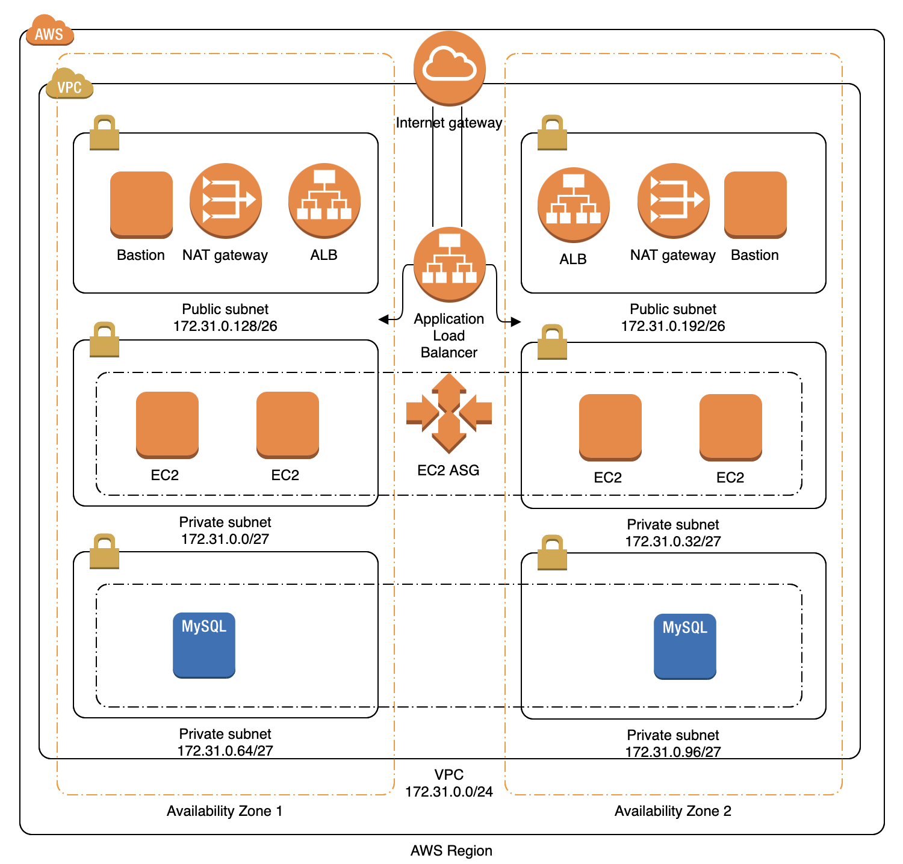

# Deploy Todo Application with RDS(MySql) on AWS EC2




1. Here application  and dataBase are deployed in different private subnets which are not directly accessible to outside world.
2. Bastion is on  public subnet which will provide access through ssh to connect to application(EC2) or database (RDS)  for troubleshooting.
3. Nat Gateway provides access to internet to the private subnets.
4. For deploying application on to EC2 we need an AMI (Amazon Machine Image) which will be created using packer.
5. To get high availability of Todo App, we deploy our Todo app to run on at least two Availability Zones (AZs). The load balancer also needs at least 2 public subnets in different AZs.

**About:** This is an example showing how to deploy a Todo application integrated with RDS(MySql) on to multiple AZs.

## Steps to deploy application ##

- Install AWS CLI

  `https://cloudaffaire.com/how-to-install-aws-cli/`
  
- Install Terraform

  `https://learn.hashicorp.com/tutorials/terraform/install-cli`
  
- Setup AWS credentials

  `https://docs.aws.amazon.com/cli/latest/userguide/cli-configure-quickstart.html`
  
- Move to lab folder  in current project like below

```bash 
  
  /todo-app/aws/3-tier-app/lab
    
```
  
- Run below command to create VPC on AWS

``` bash 
     
  terraform apply -var-file=vpc/terraform.tfvars vpc 
  
```

- Run below command to create security group 

``` bash 
     
  terraform apply -var-file=security/terraform.tfvars security 
  
```
- Run below command to create database

``` bash 
     
  terraform apply -var-file=database/mysql/terraform.tfvars database/mysql
  
```
- Move to packer folder in the current project
 
``` bash
    
    /todo-app/aws/3-tier-app/packer
    
```
- Run below commands to create ssh key and set environment variables

``` bash     
  eval `ssh-agent -s`
  ssh-keygen -t rsa -C "your_email@example.com" -f todo
  export APP_VERSION="1.0.0"
  export AWS_REGION="us-west-2"       
```
  

- Run below command to create AMI image of the Todo Application using packer and upload to AWS EBS

``` bash
  
 packer build todo.json
     
```

- Run below command to  deploy Todo App AMI on to EC2

```bash

  terraform apply -var-file=services/todo/app/terraform.tfvars services/todo/app
  
```

## To check the application ##

- Login to AWS console using your own credentials
- Click on  services and then to EC2
- Under EC2 click on LoadBalancers
- Under LoadBalancers goto DNS Name
- Copy that and past to web browser with appending '/swagger-ui/
- Now you should see the swagger page for TODO application

## To check TODO application status for troubleshoot ##

- Run below command to install dependencies for bastion terraform script

```bash

   terraform init -var-file=bastion/terraform.tfvars bastion

```

- Run below command to verify  bastion terraform script

```bash

   terraform plan -var-file=bastion/terraform.tfvars bastion

```

- Run below command to create  bastion or jumpbox on AWS

```bash

   terraform apply -var-file=bastion/terraform.tfvars bastion

```
- Run below command 

```bash
  ssh -i <private-key-file(todo)> -A todo@<bastion-public-ip>
  ssh -i <private-key-file(todo)> -A todo@<todo-app-private-ip>
  sudo systemctl status todo
  
```


## AWS Resources used for Todo Application

- AWS EBS (Elastic Block Storage)
- AWS EC2 (Elastic Compute Cloud)
- AWS RDS (Relational Database Service)
- AWS VPC (Virtual Private Cloud)
- AWS IGW (Internet Gate Way)
- AWS ALB (Application Load Balancer)
- AWS ASG (Auto Scaling Group)
- AWS NAT (Network Address Translation)
- AWS SG  (Security Group)
- AWS AMI (Amazon Machine Image)
